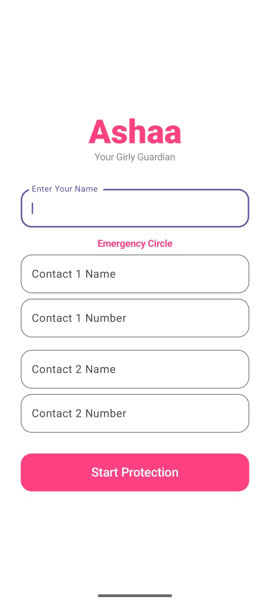
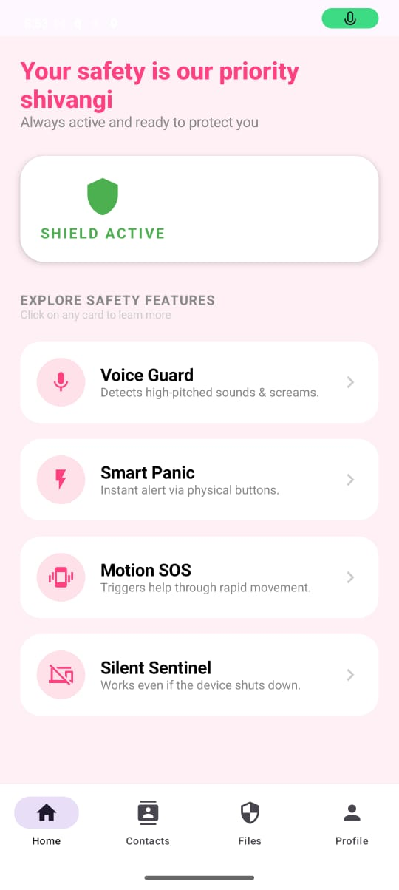
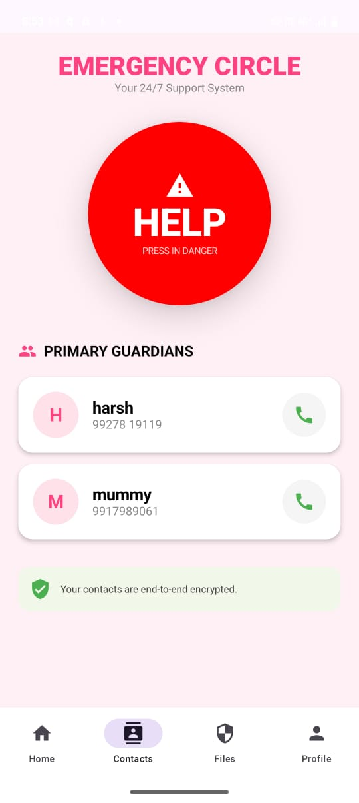
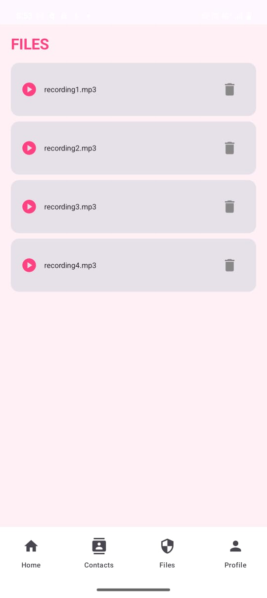
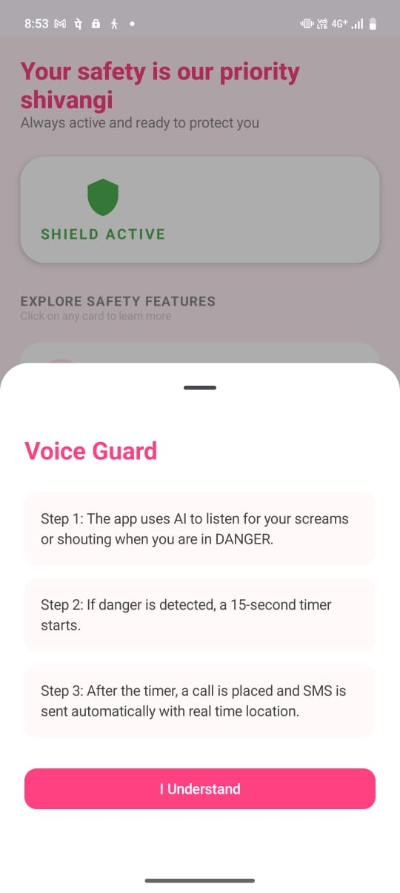
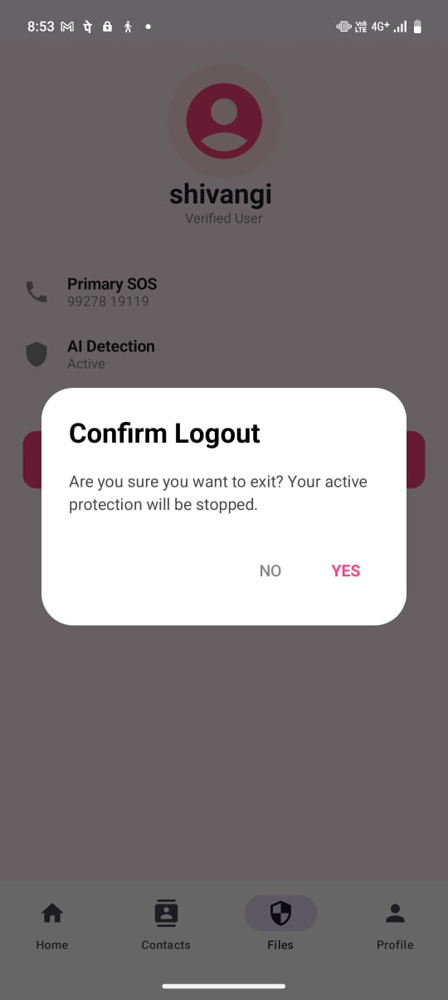

````markdown
# ASHAA — AI-Powered Women Safety Android Application

ASHAA is an AI-powered proactive women safety system designed to provide emergency assistance without requiring manual interaction during dangerous situations.

The application is built for real-world emergency scenarios where a user may be unable to unlock their phone or call for help due to panic, restraint, or physical danger.

---

## 🚀 Features

### 🔊 AI-Based Scream Detection
Utilizes the **YAMNet TensorFlow Lite model** to intelligently detect distress sounds such as human screams while reducing false alerts caused by environmental noise.

### 🆘 Hands-Free SOS Activation
Automatically triggers emergency protocols without requiring screen interaction or manual input.

### 📳 Shake-to-SOS
Detects multiple phone shakes to activate the emergency system in situations where the user cannot speak or shout.

### 📍 Live Location Sharing
Automatically sends real-time GPS coordinates to trusted contacts using Google Maps integration.

### 📞 Emergency Calling & SMS Alerts
Initiates emergency calls and sends SMS alerts after a safety countdown if the alert is not cancelled.

### 🎙️ Digital Blackbox Recording
Records background audio during emergency situations to preserve evidence and improve incident tracking.

### ⚡ Last Location Safety
Automatically shares the device's final known location if the phone is forcefully switched off or damaged.

### 🔘 Triple-Press SOS Trigger
Pressing the phone’s side/sensor button three times instantly activates the SOS workflow.

---

# 🛠️ Tech Stack

| Category | Technologies |
|----------|--------------|
| Languages | Kotlin, Java |
| UI Framework | Jetpack Compose |
| Architecture | MVVM |
| AI/ML | TensorFlow Lite (YAMNet Model) |
| Backend | Firebase Realtime Database |
| Location Services | Google Play Services, Geolocator API |
| Android Services | Foreground Services, Broadcast Receivers |
| Development Tools | Android Studio, Firebase Console |

---

# ⚙️ Technical Implementation

### Foreground Service Persistence
Implemented high-priority Foreground Services and Wakelocks to maintain continuous emergency monitoring during Android Doze Mode.

### Hardware Resource Management
Designed a "Stop-and-Switch" microphone handling mechanism to safely manage resources between AI audio detection and MediaRecorder functionality.

### Noise Reduction System
Integrated AI-assisted filtering to distinguish genuine distress sounds from background noise such as traffic or music.  

### Real-Time Emergency Workflow
Implemented automated emergency pipelines:

Scream Detection → SOS Trigger → GPS Fetch → SMS/Call → Firebase Logging

---
# 📱 Screenshots

## 🏠 Home Page


## 📊 Dashboard


## 📞 Emergency Contacts


## 🎙️ Evidence Section


## ⚡ Features Dashboard


## 👤 Profile Section

---

# 🎥 Demo

[Watch Demo Video](https://drive.google.com/file/d/1x9qnD0nCPT43GkKIQrDKD84k7LMzG-7e/view?usp=drive_link)

---

# 📦 Installation

```bash
git clone https://github.com/shivangi71/Ashaa.git
````

Open the project in Android Studio and run the application on a physical Android device.

---

# 🔮 Future Enhancements

* Smartwatch integration for discreet emergency triggering
* Nearby police station auto-alert system
* AI-powered stress and heartbeat monitoring
* Verified safe-zone navigation system

---

# 👩‍💻 Author

**Shivangi Sharma**

* GitHub: https://github.com/shivangi71
* LinkedIn: https://linkedin.com/in/sshivangisharma71

```
```
